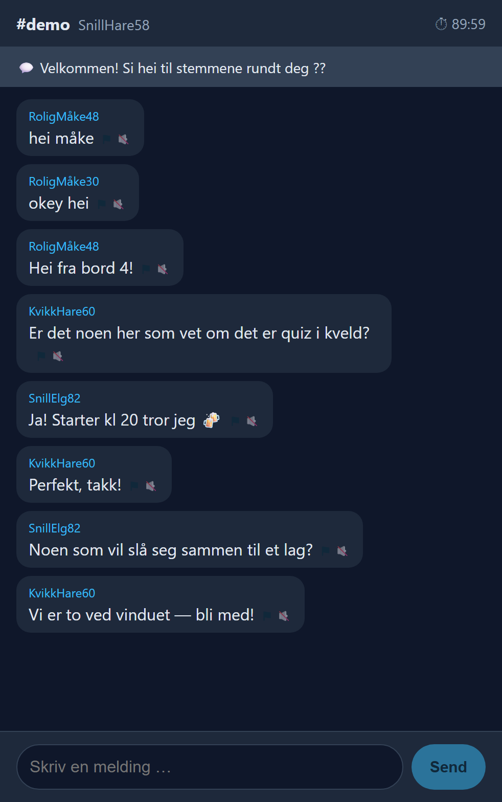

# Pratemer

**Anonymous, per-venue chat you reach by scanning a QR sticker on the table.**
No app, no account, no GPS. Each venue is its own room, and your presence is
_time-boxed to the scan_ — so nobody stays in the chat after they've left the bar.



_(An actual screenshot of the running app: two guests arranging a quiz-night team
in the `demo` room. Handles are random, messages are ephemeral, and each foreign
message carries report ⚑ and mute 🔇 controls.)_

---

## The idea in one paragraph

You're alone in a bar or café. A sticker on the table has a QR code. You scan it,
your browser opens a chat scoped to _that venue_, and you can talk anonymously with
other guests who are physically there right now. The QR sticker — not GPS — is what
defines the room and proves you chose to be in it. It's deliberately cheap to
prototype: a small web app plus printed stickers, testable in one or two Oslo venues
before committing to anything bigger.

## What we're actually testing (the plan)

Building a chat is trivial. The two hypotheses that decide whether this is a real
product are:

1. **Density** — can a _single_ venue generate enough simultaneous participation
   that the room feels alive rather than empty? (This is what killed most
   location-chat apps; Yik Yak only worked because campuses gave instant density.)
2. **Tone / safety** — can an anonymous local room stay pleasant enough that a
   _venue_ is willing to put its name on it?

Everything in this MVP exists to test those two things. Anything that doesn't
(accounts, image upload, ML moderation, GPS) is deliberately left out. The product
is intentionally a plain web app — reached by scanning a QR code, with nothing to
install — because removing that friction is core to the concept.

## Architecture

One Cloudflare Worker serves **both** the built React app and the `/api/*` routes.
Each venue maps to exactly one **Durable Object** (`Room`) — a single stateful
mini-server that owns that venue's live WebSocket connections, its recent-message
buffer, and its presence state. There is no separate database and no always-on
process; this is close to the canonical use case for Durable Objects.

```
  ┌─────────────┐   scan QR
  │  Sticker    │  ───────────►  https://app/v/:venueId   (React, served by Worker)
  └─────────────┘                       │
                                         │  POST /api/room/:venueId/join   → mint a time-boxed session
                                         │  WS   /api/room/:venueId/ws?sid → open the live socket
                                         ▼
                          ┌──────────────────────────────┐
                          │   Room  (Durable Object)      │   one instance per venue
                          │   • live WebSockets           │   (idFromName(venueId))
                          │   • recent-message buffer     │
                          │   • sessions + presence       │
                          │   • alarm() sweep every 60s   │
                          └──────────────────────────────┘
```

| File | Role |
|------|------|
| `worker/index.ts` | Front door: routes `/api/room/:venueId/*` to the venue's DO, else serves the app. |
| `worker/room.ts`  | The `Room` Durable Object — presence, messages, filter, kill-switch, alarm. |
| `src/App.tsx`     | React chat UI: join → WebSocket → live, plus the re-scan / paused screens. |
| `src/styles.css`  | Mobile-first dark theme. |
| `scripts/admin.mjs` | CLI for the per-venue kill-switch and daily prompt. |
| `wrangler.toml`   | Worker config, DO binding + migration, static-assets binding. |

## The presence model (the important part)

This is the answer to _"how do we stop people staying in the chat after they leave
the venue?"_ Because the sticker is static, we can't continuously verify presence —
so instead **presence expires by default** and the only way back in is a fresh scan.
All of it is enforced in `worker/room.ts`:

| Cap | Field | Default | Meaning |
|-----|-------|---------|---------|
| **Hard** | `sessionTtlMs` | 90 min | Max life of one scan. Then you must re-scan the sticker. |
| **Sliding** | `idleMs` | 15 min | Disconnected after this much silence (refreshed by every message + a 30 s heartbeat). |
| **Message TTL** | `msgTtlMs` | 3 h | Messages auto-delete — the room stays fresh and liability stays low. |

A per-minute `alarm()` inside the DO does the enforcement in one pass:

1. purges messages older than `msgTtlMs` (ephemerality), and
2. sweeps every session where `now > expiresAt` **or** `now - lastSeen > idleMs`,
   closes its sockets, and tells the client to re-scan.

Someone who walks out stops interacting, so the sliding cap sweeps them out well
before the hard cap. Someone actively chatting stays until the hard cap forces a
re-scan. Treat `90 / 15 / 3h` as **dials to tune from the pilot** — a lunch café and
a Friday-night bar will want different numbers.

## Other moderation features

- **Word filter** — runs on message ingest in the DO (`BADWORDS`; swap for a real
  Norwegian + English list before a real pilot).
- **Report ⚑** — per foreign message; currently logs (TODO: alert operator /
  auto-hide after N reports).
- **Mute 🔇** — client-side, per `senderId`, persisted in `localStorage`.
- **Per-venue kill-switch** — a venue (or you) can pause a room instantly; live
  guests drop cleanly to a "Praten er på pause" screen.
- **Seeded daily prompt** — shown at the top so a quiet room never looks empty.
- **Basic rate limit** — `minMsgGapMs` (800 ms) per session.

## Run it locally

```bash
npm install
npm start          # builds the app, then `wrangler dev` (real Durable Object + WebSockets)
```

Open **http://localhost:8787/v/demo** in two browser windows to act as two guests.
The `⏱` countdown in the header is the hard cap; for quick testing of the expiry
behaviour, temporarily lower `sessionTtlMs` / `idleMs` in `worker/room.ts`.

> **Note:** use `npm start`, not `npm run dev`. Plain Vite (`npm run dev`) serves
> only the frontend with no backend — you need `wrangler dev` for the Worker + DO +
> real WebSockets.

## Admin (kill-switch + daily prompt)

```bash
node scripts/admin.mjs demo status                          # show config + live counts
node scripts/admin.mjs demo off                             # pause the room
node scripts/admin.mjs demo on                              # resume
node scripts/admin.mjs demo prompt "Hva hører du på i kveld?"   # set the daily prompt
```

Env overrides: `BASE` (default `http://localhost:8787`) and `ADMIN_SECRET`
(default `dev-secret-change-me`).

## Deploy

```bash
npx wrangler secret put ADMIN_SECRET   # set a real secret first — don't ship the default
npm run deploy
```

Requires the **Workers Paid plan (~$5/mo)** — Durable Objects aren't on the free
tier. Everything else (Worker requests, static assets) fits comfortably within free
limits at pilot scale. Realistic running cost for a two-venue test: **~$5/month +
the cost of printing stickers.**

## Path to a live pilot

Deploying is the easy part; a handful of things should be in place before a sticker
goes on a real table. Roughly in order:

**1. Stand up a live environment**
- Cloudflare account on the Workers Paid plan, with `ADMIN_SECRET` set as a real secret.
- A short, memorable custom domain (some phones surface the URL, and people may type it).
- Confirm in production what only prod can prove: the Durable Object migration applied,
  and WebSockets work over `wss://` on the real domain.

**2. Add just enough observability**
- Per-venue counters for unique joins, messages sent, and peak concurrent connections.
  This is the data that answers the **density** hypothesis — wire it in before the
  pilot, not after.

**3. Close the pre-pilot gaps** (see _Known gaps_ below)
- A real word filter, reports that reach a human, and the legal/privacy notice are the
  minimum bar before exposing the app to the public.

**4. Test on real phones**
- iOS Safari and Android Chrome, over cellular — not just desktop. Explicitly test the
  QR path opened from inside social-app in-app browsers (e.g. Instagram/Snapchat), which
  can handle WebSockets differently.

**5. Prepare the physical pilot**
- Print QR stickers pointing at `https://<domain>/v/<venue-slug>`.
- Have a seeding plan (a good daily prompt, a few planted opening messages) so the first
  guests never see an empty room.
- Decide success criteria up front: what join / message / return numbers justify
  continuing versus stopping.

A cheap way to de-risk before approaching venues: deploy, put the QR on your own table
somewhere among friends, and confirm the whole flow survives real phones and real people.

## Known gaps / next steps

- `BADWORDS` is a placeholder — replace with a real list before a public pilot.
- Reports only log; wire up an alert channel and/or auto-hide.
- Consider **ephemeral message auto-delete tuning** and, per venue, an optional
  Wi-Fi presence check (join only while on the venue's guest Wi-Fi) as a stronger
  presence signal than the time caps alone.
- **Legal:** even "anonymous" chat processes IPs + user content. In Norway/EEA you
  need a short privacy notice, a retention policy (ephemerality helps), and a plan
  for illegal-content / law-enforcement requests. Sort this before going public.

## Out of scope (on purpose)

Push notifications, image upload, user accounts, GPS/continuous location, ML
moderation. Kept out so the pilot stays cheap and tests the two real hypotheses
above. The app stays a scan-and-chat web page by design — there is nothing to
install.
